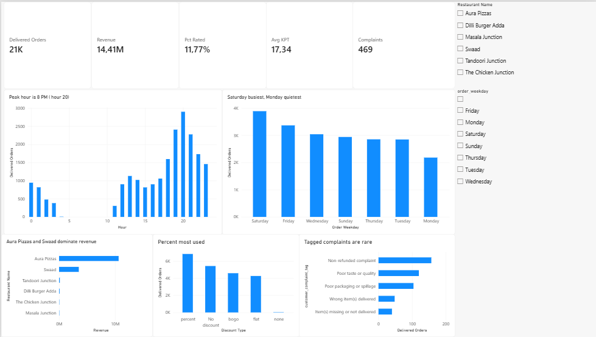
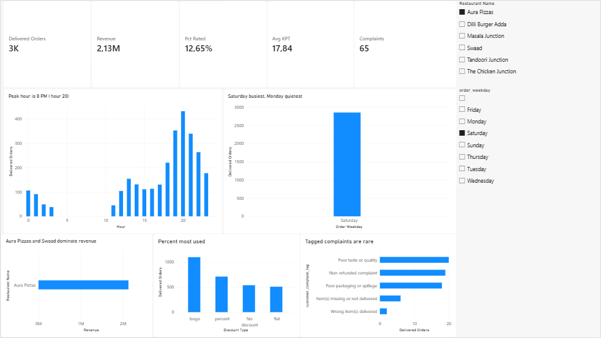

# Title
Analysis of Food Delivery Database

## Introduction
This project is a data analysis of food delivery orders across different restaurants, dates, amounts spent, and delivery details. The dataset includes ~21,000 records of Kaggle orders with their details. A food delivery dataset was chosen, since I work in the hospitality industry (started as a McDonald's employee and transferred to a Banquet Server in a private premier club, Granite Club), therefore a food-themed dataset suited my situation. I found it very exciting analysing a dataset that records timings of delivered orders, discount types and customer satisfaction.

## Tools
Necessary tools for this project: Python + SQLite + Power BI

## Metrics

- **Delivered orders:** `order_status = Delivered` only (~21,131). Cancelled / rejected / timed out are out of the dashboard and the SQL findings.
- **Revenue:** `SUM(total)` on delivered orders.
- **Average KPT:** kitchen prep minutes, only where `kpt_minutes` is filled (`view_kitchen_time`). Blanks are not filled with 0 or the mean.
- **Average rating / % rated:** only delivered rows with a real rating (`view_rated_orders`, ~2,491). Empty rating is not 0.
- **Complaints:** delivered orders whose `customer_complaint_tag` is not `No complaint` (469). `No complaint` means no tag, not “happy.”

## Findings

- **Two restaurants are the business.** Aura Pizzas ~14,417 delivered orders and ~10.65M revenue; Swaad ~6,282 and ~3.52M. That is most of ~21,131 delivered orders and ~14.42M revenue. The other four restaurants are small.
- **One hour vs none.** Hour 20 (8 pm) is the peak (~2,900 delivered orders). Hours 5-10 am have zero delivered orders.
- **Saturday vs Monday.** Saturday ~3,888 orders / ~2.75M; Monday ~2,182 / ~1.39M (about 1.8× fewer orders).
- **Feedback is rare.** ~2,491 orders have a rating (~12%). 469 have a real complaint tag (~2%). `No complaint` means no tag. Among 1-2 ratings, most still have `No complaint`.
- **Kitchen time does not move with stars.** Peak-hour KPT ~18.4 min (not the slowest). 1 average KPT ~17.40 vs 5 ~17.74.

## Suggestions

- **Feedback appreciation.** A small discount (or thank-you) for leaving feedback could raise the ~12% rating rate and bring more customer reviews. It may not give a clear “how to fix delivery” list – many new ratings will just be 5 stars.
- **Morning promotion.** Morning until 10 am is the slowest window (no delivered orders). A breakfast promo or item discount could be tested if restaurants are actually open then. This data alone does not prove guests are waiting for a morning deal.

## Power BI Charts




## How to run
```bash
pip install -r requirements.txt
